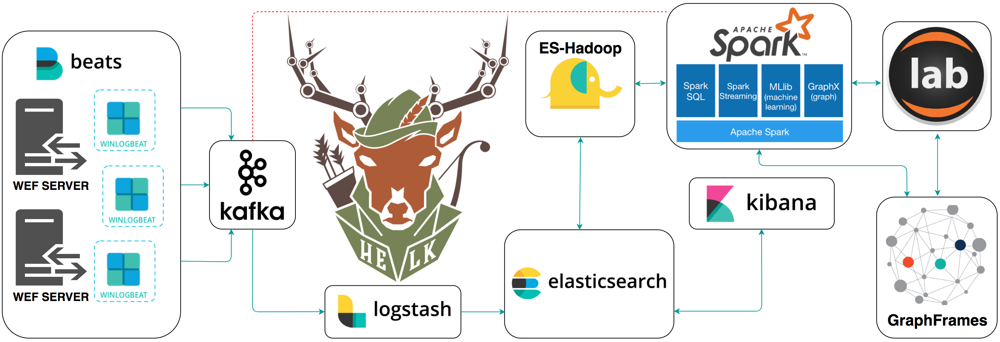

# HELK [Alpha]
A Hunting ELK (Elasticsearch, Logstash, Kibana) with advanced analytic capabilities.



# Goals
* Provide a free hunting platform to the community and share the basics of Threat Hunting.
* Make sense of a large amount of event logs and add more context to suspicious events during hunting.
* Expedite the time it takes to deploy an ELK stack.
* Improve the testing of hunting use cases in an easier and more affordable way.
* Enable Data Science via Apache Spark, GraphFrames & Jupyter Notebooks.

# Current Status: Alpha
The project is currently in an alpha stage, which means that the code and the functionality are still changing. We haven't yet tested the system with large data sources and in many scenarios. We invite you to try it and welcome any feedback.

# HELK Features
* **Kafka:** A distributed publish-subscribe messaging system that is designed to be fast, scalable, fault-tolerant, and durable.
* **Elasticsearch:** A highly scalable open-source full-text search and analytics engine.
* **Logstash:** A data collection engine with real-time pipelining capabilities.
* **Kibana:** An open source analytics and visualization platform designed to work with Elasticsearch.
* **ES-Hadoop:** An open-source, stand-alone, self-contained, small library that allows Hadoop jobs (whether using Map/Reduce or libraries built upon it such as Hive, Pig or Cascading or new upcoming libraries like Apache Spark ) to interact with Elasticsearch.
* **Spark:** A fast and general-purpose cluster computing system. It provides high-level APIs in Java, Scala, Python and R, and an optimized engine that supports general execution graphs.
* **GraphFrames:** A package for Apache Spark which provides DataFrame-based Graphs.
* **Jupyter Notebook:** An open-source web application that allows you to create and share documents that contain live code, equations, visualizations and narrative text.
* **Sigma:** A generic signature format for log events. All Sigma signatures contained in the repository are preloaded into Kibana.

# Resources
* [Setting up a Pentesting.. I mean, a Threat Hunting Lab - Part 5](https://cyberwardog.blogspot.com/2017/02/setting-up-pentesting-i-mean-threat_98.html)
* [An Integrated API for Mixing Graph and Relational Queries](https://cs.stanford.edu/~matei/papers/2016/grades_graphframes.pdf)
* [Graph queries in Spark SQL](https://www.slideshare.net/SparkSummit/graphframes-graph-queries-in-spark-sql)
* [Graphframes Overview](http://graphframes.github.io/index.html)
* [Elastic Producs](https://www.elastic.co/products)
* [Elasticsearch Guide](https://www.elastic.co/guide/en/elasticsearch/reference/current/index.html)
* [spujadas elk-docker](https://github.com/spujadas/elk-docker)
* [deviantony docker-elk](https://github.com/deviantony/docker-elk)
* [Sigma](https://github.com/Neo23x0/sigma)

# Getting Started
## WIKI
* [Introduction](https://github.com/Cyb3rWard0g/HELK/wiki)
* [Architecture Overview](https://github.com/Cyb3rWard0g/HELK/wiki/Architecture-Overview)
  * [Kafka](https://github.com/Cyb3rWard0g/HELK/wiki/Kafka)
  * [Logstash](https://github.com/Cyb3rWard0g/HELK/wiki/Logstash)
  * [Elasticsearch](https://github.com/Cyb3rWard0g/HELK/wiki/Elasticsearch)
  * [Kibana](https://github.com/Cyb3rWard0g/HELK/wiki/Kibana)
  * [Spark](https://github.com/Cyb3rWard0g/HELK/wiki/Spark)
* [Installation](https://github.com/Cyb3rWard0g/HELK/wiki/Installation)

## (Docker) Accessing the HELK's Images
By default, the HELK's containers are run in the background (Detached). Therefore, you will have to access your docker images by running the following commands:
```
sudo docker exec -ti <image-name> bash
root@7a9d6443a4bf:/opt/helk/scripts#
```

# Author
* Roberto Rodriguez [@Cyb3rWard0g](https://twitter.com/Cyb3rWard0g) [@THE_HELK](https://twitter.com/THE_HELK)

# Contributors
* Robby Winchester [@robwinchester3](https://twitter.com/robwinchester3)
* Jared Atkinson [@jaredatkinson](https://twitter.com/jaredcatkinson)
* Nate Guagenti [@neu5ron](https://twitter.com/neu5ron)
* Jordan Potti [@ok_bye_now](https://twitter.com/ok_bye_now)
* Lee Christensen [@tifkin_](https://twitter.com/tifkin_)

# Contributing
There are a few things that I would like to accomplish with the HELK as shown in the To-Do list below. I would love to make the HELK a stable build for everyone in the community. If you are interested on making this build a more robust one and adding some cool features to it, PLEASE feel free to submit a pull request. #SharingIsCaring

# TO-Do
- [X] Upload basic Kibana Dashboards
- [X] Integrate Spark & Graphframes
- [X] Add Jupyter Notebook on the top of Spark
- [X] Kafka Integration
- [ ] Create Jupyter Notebooks showing how to use Spark & GraphFrames
- [ ] MITRE ATT&CK mapping to logs or dashboards
- [ ] Cypher for Apache Spark Integration (Might have to switch from Jupyter to Zeppelin Notebook) 
- [ ] Somehow integrate neo4j spark connectors with build
- [ ] Install Elastalert & Create Rules
- [ ] Nxlog parsers (Logstash Filters)
- [ ] Add more network data sources (i.e Bro)
- [ ] Research & integrate spark structured direct streaming
- [ ] Research & intgrate KSQL

More coming soon...
