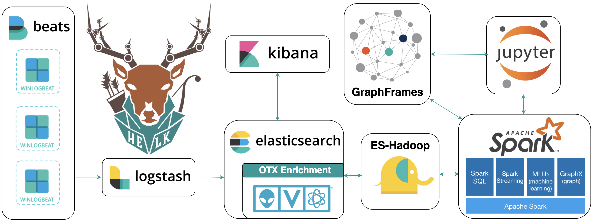

# HELK [Beta]
A Hunting ELK (Elasticsearch, Logstash, Kibana) with advanced analytic capabilities.



# Goals
* Provide a free hunting platform to the community and share the basics of Threat Hunting.
* Make sense of a large amount of event logs and add more context to suspicious events during hunting.
* Expedite the time it takes to deploy an ELK stack.
* Improve the testing of hunting use cases in an easier and more affordable way.
* Enable Data Science via Apache Spark, GraphFrames & Jupyter Notebooks.

# Resources
* [Setting up a Pentesting.. I mean, a Threat Hunting Lab - Part 5](https://cyberwardog.blogspot.com/2017/02/setting-up-pentesting-i-mean-threat_98.html)
* [An Integrated API for Mixing Graph and Relational Queries](https://cs.stanford.edu/~matei/papers/2016/grades_graphframes.pdf)
* [Graph queries in Spark SQL](https://www.slideshare.net/SparkSummit/graphframes-graph-queries-in-spark-sql)
* [Graphframes Overview](http://graphframes.github.io/index.html)
* [Elastic Producs](https://www.elastic.co/products)
* [Elasticsearch Guide](https://www.elastic.co/guide/en/elasticsearch/reference/current/index.html)
* [spujadas elk-docker](https://github.com/spujadas/elk-docker)
* [deviantony docker-elk](https://github.com/deviantony/docker-elk)

# Getting Started

## Requirements
* OS Name: Linux (Debian-based systems)
	* Bash Script Option: Tested on Ubuntu-16.04.2 Server amd64 (Xenial)
* Network Connection: NAT or Bridge
* RAM: 4GB (minimum)
* Applications:
	* Docker(Needed for HELK Docker Installation ONLY)
* Winlogbeat running on your endpoints (At least sending Sysmon and Windows Security event logs)
	* HELK's current version parses logs shipped by Winlogbeat ONLY (Nxlog parsing is coming soon)

## Automatic Installation Options
The HELK project comes with three options:
* Pulling the latest HELK Docker Image from cyb3rward0g dockerhub
* Building the HELK image from a local Dockerfile
* Installing the HELK from a local bash script
```
git clone https://github.com/Cyb3rWard0g/HELK.git
cd HELK/
sudo ./helk_install.sh

**********************************************
**           HELK - M E N U                 **
**                                          **
** Author: Roberto Rodriguez (@Cyb3rWard0g) **
** HELK build version: 0.9 (BETA)           **
** HELK ELK version: 6.x                    **
** License: BSD 3-Clause                    **
**********************************************
 
1. Pull the latest HELK image from DockerHub
2. Build the HELK image from local Dockerfile
3. Install the HELK from local bash script
4. Exit
 
[HELK-INSTALLATION-INFO] Enter choice [ 1 - 4]
```

## HELK Initial Settings
At the end of the HELK installation, you will have a similar output with the information you need to access the primary HELK components. Remember that the default username and password for the HELK are helk:hunting.

```
***********************************************************************************
** [HELK-INSTALLATION-INFO] YOUR HELK IS READY                                   **
** [HELK-INSTALLATION-INFO] USE THE FOLLOWING SETTINGS TO INTERACT WITH THE HELK **
***********************************************************************************
 
HELK KIBANA URL: http://192.168.1.243
HELK KIBANA USER: helk
HELK KIBANA PASSWORD: hunting
HELK JUPYTER CURRENT TOKEN: bf329433d64f735ae50dce73bab995bb240194a98b84bfd2
HELK SPARK UI: http://192.168.1.243:4040
HELK JUPYTER NOTEBOOK URI: http://192.168.1.243:8880
HELK DOCKER BASH ACCESS: sudo docker exec -ti helk bash
 
IT IS HUNTING SEASON!!!!!
```

## Visualize your logs (Discover)
Make sure you have logs being sent to your HELK first (At least Windows security events). Then, go to http://<HELK's IP> in your preferred browser. (If you dont have logs being sent to your HELK you will have to wait and repeat the first steps of this section)
Currently, the HELK has 6 indices created automatically by its default configs:
* "*" - All
* "sysmon-*"
* "winevent-security-*"
* "winevent-application-*"
* "winevent-system-*"
* "powershell-*"


## Visualize your logs (Dashboards)
Make sure you have logs being sent to your HELK first (At least Windows security events). Then, go to http://<HELK's IP> in your preferred browser. (If you dont have logs being sent to your HELK you will have to wait and repeat the first steps of this section)
Currently, the HELK provides 3 dashboards:
* Global_Dashboard
* Network_Dashboard
* Sysmon_Dashboard


## (Docker) Accessing the HELK's container
By default, the HELK's container is run in the background. Therefore, you will have to access your docker container by running the following commands:
```
sudo docker exec -ti helk bash
root@7a9d6443a4bf:/opt/helk/scripts#
```

## Checking HELK integrations (Spark, Graphframes & Jupyter)
* (Bash script Install) If the HELK was installed via the local bash script, make sure you enable the .bashrc file before starting the Jupyter server.
```
source ~/.bashrc && pyspark
```
* (Docker Install) By default, the Jupyter server gets started automatically after building or pulling the HELK's container.
* Access the Jupyter Server: 
	* Go to your <Container's IP>:8880 in your preferred browser
	* Enter the token provided after installing the HELK
* Go to the scripts/training/jupyter_notebooks/getting_started/ folder
* Open the Check_Spark_Graphframes_Integrations notebook
	* Check the saved output (Make sure that you have Sysmon * Windows Security event logs being sent to your HELK. Otherwise you will get errors in your Jupyter Notebook when trying to replicate the basic commands)
	* Clear the output from the notebook and run everything again


## HELK's Heap Size
By default, HELK calculates how much memory the host has and assigns 50% of it to it (You can change that by manually modifying the /etc/elasticsearch/jvm.options file after the installation and restarting your elasticsearch service)
```
sudo nano /etc/elasticsearch/jvm.options
sudo service elasticsearch restart
```

# Troubleshooting the HELK:
## HELK Installation Logs
* HELK Install Logs: 
	* /var/log/helk-install.log
* HELK Docker Logs: 
```
sudo docker logs helk
```

## HELK Application Logs
* Elasticsearch:
	* /var/log/elasticsearch/elasticsearch.log 
* Logstash:
	* /var/log/logstash/logstash-plain.log
* Kibana:
	* /var/log/kibana/kibana.stdout
	* /var/log/kibana/kibana.stderr

# Author
* Roberto Rodriguez [@Cyb3rWard0g](https://twitter.com/Cyb3rWard0g) [@THE_HELK](https://twitter.com/THE_HELK)

# Contributors
* Robby Winchester [@robwinchester3](https://twitter.com/robwinchester3)
* Nate Guagenti [@neu5ron](https://twitter.com/neu5ron)
* Jordan Potti [@ok_bye_now](https://twitter.com/ok_bye_now)
* esebese [esebese](https://github.com/esebese)

# Contributing
There are a few things that I would like to accomplish with the HELK as shown in the To-Do list below. I would love to make the HELK a stable build for everyone in the community. If you are interested on making this build a more robust one and adding some cool features to it, PLEASE feel free to submit a pull request. #SharingIsCaring

# TO-Do
- [X] Upload basic Kibana Dashboards
- [X] Integrate Spark & Graphframes
- [X] Add Jupyter Notebook on the top of Spark
- [ ] Kafka Integration
- [ ] Create Jupyter Notebooks showing how to use Spark & GraphFrames
- [ ] Enhance elasticsearch configuration to make it more scalable
- [ ] MITRE ATT&CK mapping to logs or dashboards
- [ ] Cypher for Apache Spark Integration (Might have to switch from Jupyter to Zeppelin Notebook) 
- [ ] Somehow integrate neo4j spark connectors with build
- [ ] Install Elastalert
- [ ] Create Elastalert rules
- [ ] Nxlog parsers (Logstash Filters)
- [ ] Add more network data sources (i.e Bro)
- [ ] Create wiki article on setting up endpoint to send logs into HELK

More coming soon...

