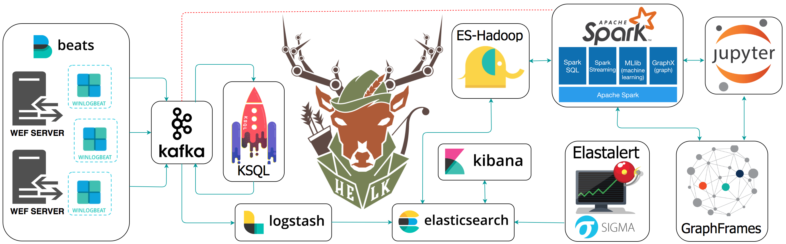

# HELK

The Hunting ELK or simply the HELK is one of the first open source hunt platforms with  advanced analytics capabilities such as SQL declarative language, graphing, structured streaming, and even machine learning via Jupyter notebooks and Apache Spark over an ELK stack. This project was developed primarily for research, but due to its flexible design and core components, it can be deployed in larger environments with the right configurations and scalable infrastructure.

# Goals

* Provide an open source hunting platform to the community and share the basics of Threat Hunting.
* Expedite the time it takes to deploy a hunt platform.
* Improve the testing and development of hunting use cases in an easier and more affordable way.
* Enable Data Science capabilities while analyzing data via Apache Spark, GraphFrames & Jupyter Notebooks.

# Current Status: Alpha

The project is currently in an alpha stage, which means that the code and the functionality are still changing. We haven't yet tested the system with large data sources and in many scenarios. We invite you to try it and welcome any feedback.

## Docs:

* [Introduction](https://thehelk.com/intro.html)
* [Installation](https://thehelk.com/installation.html)

# Resources

* [Welcome to HELK! : Enabling Advanced Analytics Capabilities](https://cyberwardog.blogspot.com/2018/04/welcome-to-helk-enabling-advanced_9.html)
* [Spark](https://spark.apache.org/docs/latest/index.html)
* [Spark Standalone Mode](https://spark.apache.org/docs/latest/spark-standalone.html)
* [Setting up a Pentesting.. I mean, a Threat Hunting Lab - Part 5](https://cyberwardog.blogspot.com/2017/02/setting-up-pentesting-i-mean-threat_98.html)
* [An Integrated API for Mixing Graph and Relational Queries](https://cs.stanford.edu/~matei/papers/2016/grades_graphframes.pdf)
* [Graph queries in Spark SQL](https://www.slideshare.net/SparkSummit/graphframes-graph-queries-in-spark-sql)
* [Graphframes Overview](http://graphframes.github.io/index.html)
* [Elastic Products](https://www.elastic.co/products)
* [Elastic Subscriptions](https://www.elastic.co/subscriptions)
* [Elasticsearch Guide](https://www.elastic.co/guide/en/elasticsearch/reference/current/index.html)
* [spujadas elk-docker](https://github.com/spujadas/elk-docker)
* [deviantony docker-elk](https://github.com/deviantony/docker-elk)

# Author

* Roberto Rodriguez [@Cyb3rWard0g](https://twitter.com/Cyb3rWard0g) [@THE_HELK](https://twitter.com/THE_HELK)

# Current Committers

* Nate Guagenti [@neu5ron](https://twitter.com/neu5ron)

# Contributing

There are a few things that I would like to accomplish with the HELK as shown in the To-Do list below. I would love to make the HELK a stable build for everyone in the community. If you are interested on making this build a more robust one and adding some cool features to it, PLEASE feel free to submit a pull request. #SharingIsCaring

# License: GPL-3.0

[ HELK's GNU General Public License](https://github.com/Cyb3rWard0g/HELK/blob/master/LICENSE)

# TO-Do

- [ ] Kubernetes Cluster Migration
- [ ] OSQuery Data Ingestion
- [ ] MITRE ATT&CK mapping to logs or dashboards
- [ ] Cypher for Apache Spark Integration (Adding option for Zeppelin Notebook)
- [ ] Test and integrate neo4j spark connectors with build
- [ ] Add more network data sources (i.e Bro)
- [ ] Research & integrate spark structured direct streaming
- [ ] Packer Images
- [ ] Terraform integration (AWS, Azure, GC)
- [ ] Add more Jupyter Notebooks to teach the basics
- [ ] Auditd beat intergation

More coming soon...
